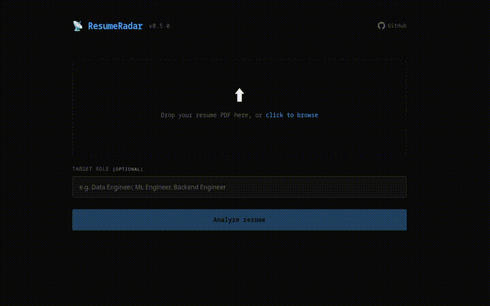

# ResumeRadar

> AI-powered resume analyzer. Upload your PDF, get matched against real remote job postings, surface skill gaps, get targeted rewrite suggestions, and download a formatted PDF report.

[](https://python.org)
[](https://fastapi.tiangolo.com)
[](https://langchain-ai.github.io/langgraph/)
[](https://trychroma.com)
[](https://docker.com)
[](https://github.com/fulviofavilla/resume-radar/actions)
[](LICENSE)

---



---

## How it works

```
your resume.pdf
      |
      v
┌─────────────────┐     ┌──────────────────┐
│  parse_resume   │     │   search_jobs    │
│                 │     │                  │
│ LLM extracts:   │────>│ RemoteOK + Adzuna│
│ • explicit      │     │ weighted keyword  │
│   skills        │     │ relevance filter  │
│ • inferred      │     └────────┬─────────┘
│   capabilities  │              │
└─────────────────┘              │
                                 v
                    ┌────────────────────────┐
                    │      embed_match       │
                    │                        │
                    │ OpenAI embeddings +    │
                    │ ChromaDB cosine sim    │
                    │ -> match_score: 0.81   │
                    └────────────┬───────────┘
                                 │
                                 v
                    ┌────────────────────────┐
                    │    generate_report     │
                    │                        │
                    │ LLM -> 5 actionable    │
                    │ recommendations        │
                    └────────────┬───────────┘
                                 │
                                 v
                    ┌────────────────────────┐
                    │    rewrite_resume      │
                    │                        │
                    │ LLM scores bullets,    │
                    │ rewrites weak ones     │
                    │ anchored to market     │
                    └────────────────────────┘
```

---

## Demo

```bash
# 1. Start the stack
docker compose up --build

# 2. Open the UI
# http://localhost:8000

# 3. Or use the API directly
curl -X POST http://localhost:8000/analyze \
  -F "file=@resume.pdf" \
  -F "target_role=Data Engineer"

# -> {"job_id": "ae200425-...", "status": "processing"}

# 4. Stream progress in real time
curl -N http://localhost:8000/progress/ae200425-...

# 5. Get full results
curl http://localhost:8000/results/ae200425-... | python3 -m json.tool

# 6. Download PDF report
curl http://localhost:8000/results/ae200425-.../pdf -o report.pdf
```

**Output:**
```json
{
  "status": "completed",
  "resume_profile": {
    "skills": ["Python", "SQL", "AWS", "Apache Airflow", "Docker", "PySpark"],
    "inferred_skills": ["ETL pipelines", "data governance", "CI/CD", "pipeline automation"],
    "seniority": "mid",
    "years_of_experience": 2
  },
  "report": {
    "gap_analysis": {
      "match_score": 0.81,
      "strengths": ["Python", "SQL", "AWS", "Azure", "Docker", "data engineering"],
      "missing_skills": ["dbt", "Kafka"]
    },
    "recommendations": [
      "Add dbt to your stack - appears in 4/5 top jobs, unlocks $30-50/hr roles",
      "Highlight Apache Airflow prominently - strong differentiator for data pipeline roles"
    ],
    "jobs_analyzed": 5,
    "resume_rewrites": [
      {
        "original": "Designed and optimized scalable data pipelines...",
        "rewrite": "Engineered scalable data pipelines processing 10M+ daily records...",
        "reason": "Original lacked specificity and quantification.",
        "section": "Software Engineer Intern",
        "alignment_note": "Incorporates 'data pipelines' - present in 4/5 top matching jobs.",
        "quantification_is_estimated": true
      }
    ]
  }
}
```

> **Note on `quantification_is_estimated`:** when `true`, the rewrite introduced numeric metrics not present in the original bullet. These are suggested placeholders - replace them with your real numbers before updating your resume.

---

## Stack

| Layer | Tech |
|---|---|
| Agent Orchestration | LangGraph (stateful 5-node graph) |
| LLM | OpenAI (default: `gpt-4o-mini`, configurable via `OPENAI_MODEL`) |
| Embeddings | OpenAI (default: `text-embedding-3-small`, configurable via `OPENAI_EMBEDDING_MODEL`) |
| Vector DB | ChromaDB 1.0 (Docker service, cosine similarity) |
| Job Store | Redis 7 (persists results across restarts, 24h TTL) |
| API | FastAPI + Uvicorn (async, background tasks) |
| Rate Limiting | slowapi (5 req/hour per IP on `POST /analyze`) |
| PDF Parsing | pdfplumber |
| PDF Report | weasyprint + self-hosted fonts |
| Job Sources | RemoteOK (no auth) + Adzuna (free tier) |
| Frontend | HTML + vanilla JS (served via FastAPI StaticFiles) |
| Containerization | Docker + Docker Compose |
| CI | GitHub Actions (pytest on push and PR) |

---

## Quickstart

**Prerequisites:** Docker · OpenAI API key

```bash
git clone https://github.com/fulviofavilla/resume-radar
cd resume-radar

cp .env.example .env
# Add your OPENAI_API_KEY to .env

docker compose up --build
```

- **UI:** `http://localhost:8000`
- **API docs:** `http://localhost:8000/docs`
- ChromaDB runs on port `8001` and persists embeddings via a named Docker volume.
- Redis runs on port `6379` and persists job results via a named Docker volume (24h TTL).

**Optional:** Add Adzuna credentials to `.env` for broader job coverage - free tier, 250 req/day at [developer.adzuna.com](https://developer.adzuna.com/).

---

## API Reference

### `POST /analyze`

Upload a resume PDF and start an analysis job. Rate limited to **5 requests per hour per IP**.

| Field | Type | Required | Description |
|---|---|---|---|
| `file` | PDF (multipart) | yes | Resume file, max 10 MB |
| `target_role` | string (form) | no | Focus the job search (e.g. `"Data Engineer"`) |

Returns `{ job_id, status, message }`.

### `GET /progress/{job_id}`

SSE stream of node-level progress events. Each event is a JSON object:

```
data: {"step": "parse_resume",    "message": "Parsing resume and extracting skills..."}
data: {"step": "search_jobs",     "message": "Searching job postings..."}
data: {"step": "embed_match",     "message": "Computing semantic match score..."}
data: {"step": "generate_report", "message": "Generating recommendations..."}
data: {"step": "rewrite_resume",  "message": "Generating resume rewrite suggestions..."}
data: {"step": "done",            "message": "Analysis complete.", "status": "completed"}
```

Stream closes automatically after a terminal event (`done` or `error`).

### `GET /results/{job_id}`

Poll for results. Returns `status: processing` while the agent runs, `status: completed` with the full payload when done:
- `resume_profile` - extracted skills, inferred capabilities, seniority
- `report.gap_analysis` - match score, strengths, missing skills
- `report.recommendations` - 5 actionable, market-aware suggestions
- `report.top_jobs` - the 5 job postings used for analysis
- `report.resume_rewrites` - targeted rewrites for weak bullets, with market alignment notes

### `GET /results/{job_id}/pdf`

Download a formatted PDF report. Includes match score, skill gaps, recommendations, rewrite suggestions side-by-side, and jobs analyzed.

```bash
curl http://localhost:8000/results/<job_id>/pdf -o report.pdf
```

### `GET /health`

```bash
curl http://localhost:8000/health
# {"status": "ok", "service": "resume-radar", "version": "0.6.0", "redis": "ok"}
```

---

## Architecture

### Agent graph

```
parse_resume -> search_jobs -> embed_match -> generate_report -> rewrite_resume
     |               |               |               |
  error?          error?          error?           END (on error)
     +---------------+---------------+---- END (early exit)
```

`rewrite_resume` is connected with a plain edge (no conditional) - it handles its own failures silently and never blocks the rest of the pipeline.

### Semantic matching

`embed_match` uses a two-pass approach:
1. **LLM extraction** - calls the configured model in parallel on each job description to extract real required skills (not noisy job board tags)
2. **Embedding + cosine similarity** - embeds both resume skills and job skills, stores in ChromaDB, queries for semantic proximity

This lifts `match_score` from ~0.1 (keyword overlap) to ~0.8 (semantic similarity). Skills like `"pipeline automation"` match `"data pipelines"` without exact string overlap.

**Fallback:** if ChromaDB is unreachable, `embed_match` automatically falls back to keyword gap analysis - the service stays functional.

### Resume rewrite

`rewrite_resume` runs two LLM calls in sequence:
1. **Segmentation** - extracts bullets and summary from raw PDF text
2. **Scoring + rewrite** - scores each bullet for market impact (1-10), rewrites those scoring 6 or below

Market anchor: uses `missing_skills` when available; falls back to the union of `required_skills` across top job postings for strong profiles (high match score, empty gaps).

### Job search

RemoteOK is filtered client-side using a weighted relevance score: title match (3 pts), tag match (2 pts), description match (1 pt). Jobs below threshold 3 are discarded. Keywords are capped at `target_role` + top 3 priority skills.

---

## Project Structure

```
resume-radar/
├── app/
│   ├── main.py              # FastAPI - /analyze, /progress/{id}, /results/{id}, /results/{id}/pdf
│   ├── agent.py             # LangGraph graph + SSE progress queue
│   ├── pdf_report.py        # weasyprint PDF generation
│   ├── vector_store.py      # ChromaDB client singleton
│   ├── models.py            # Pydantic models (AgentState, ResumeProfile, Report...)
│   ├── config.py            # Settings via pydantic-settings + .env
│   ├── nodes/
│   │   ├── parse_resume.py     # PDF -> text -> LLM -> ResumeProfile + inferred skills
│   │   ├── search_jobs.py      # Parallel job search (RemoteOK + Adzuna)
│   │   ├── embed_match.py      # OpenAI embeddings + ChromaDB gap analysis
│   │   ├── generate_report.py  # LLM recommendations
│   │   └── rewrite_resume.py   # LLM bullet scoring + targeted rewrites
│   └── tools/
│       ├── remoteok.py      # RemoteOK API client (weighted scoring, HTML strip)
│       └── adzuna.py        # Adzuna API client (HTML strip)
├── docs/                    # Demo GIF
├── static/
│   ├── fonts/               # Self-hosted woff2 (Space Mono, DM Sans)
│   └── index.html           # Frontend - upload, SSE progress, results, PDF download
├── tests/
│   └── test_agent.py
├── .github/
│   └── workflows/
│       └── ci.yml           # pytest on push to main and PRs
├── Dockerfile
├── docker-compose.yml       # api + vectordb (ChromaDB) + redis
├── requirements.txt
├── pytest.ini
├── .env.example
└── README.md
```

---

## Roadmap

- [x] v0.1 - MVP: PDF -> job search -> gap analysis -> report
- [x] v0.2 - Semantic matching (ChromaDB + OpenAI embeddings), HTML sanitization
- [x] v0.3 - Resume rewrite suggestions: bullet scoring, market-anchored rewrites, alignment notes
- [x] v0.4 - SSE progress streaming, static frontend, PDF report download
- [x] v0.5 - Frontend polish, Redis job store, rate limiting
- [x] v0.6 - PDF report redesign, self-hosted fonts, demo GIF and screenshots
- [ ] v0.7 - Manual job input: paste a job description directly, skipping the job search step

---

## Contributing

PRs welcome. Open an issue first for major changes.

---

## License

MIT